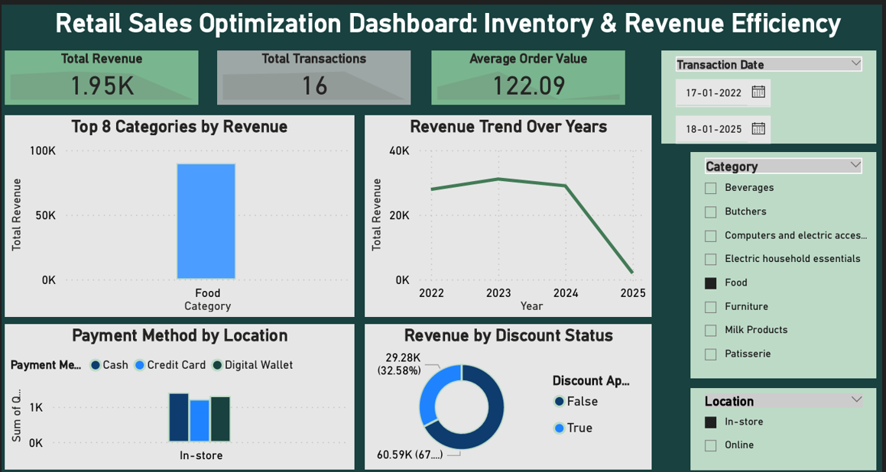

# Retail Sales Optimization Dashboard: Inventory & Revenue Efficiency

## 📊 Project Overview
This project analyzes retail sales, inventory movement, and revenue performance using Excel and Power BI. It focuses on optimizing stock management, improving revenue efficiency, identifying sales trends, and supporting data-driven business decisions through interactive dashboards.

## 🎯 Objectives
- Optimize inventory management
- Enhance revenue efficiency
- Analyze sales performance
- Identify top-performing products
- Track product trends through KPIs

## 🛠 Tools Used
- Excel (Data Cleaning & Preparation)
- Power BI (Dashboard Development & Visualization)

## 📈 Key Insights
- Identified high-revenue product categories
- Improved inventory visibility
- Analyzed revenue trends across sales periods
- Highlighted underperforming products for optimization

## 📁 Files Included
- Retail_Sales_Cleaned_Data.xlsx
- Retail_Sales_Dashboard.pdf
- dashboard-preview.png

## 📷 Dashboard Preview

